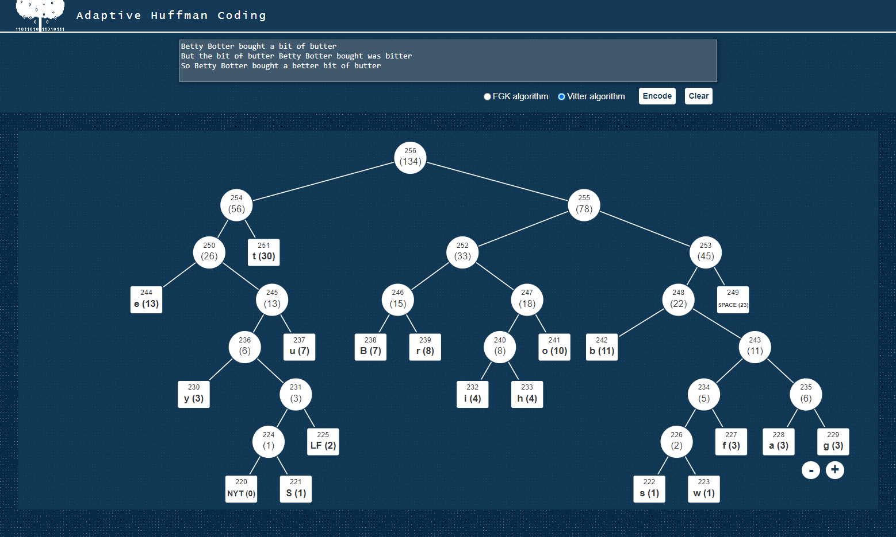

# Adaptive Huffman coding - tree visualization
An app visualizing Huffman tree structure generated using the method called Adaptive Huffman coding (also known as Dynamic Huffman coding). The app uses user-provided input to process it as transmission, adjusting the tree with every new character received. Encoding was implemented using two methods: FGK (Faller-Gallager-Knuth) and Vitter algorithm. The user can switch between both implementations.

## Screenshot

